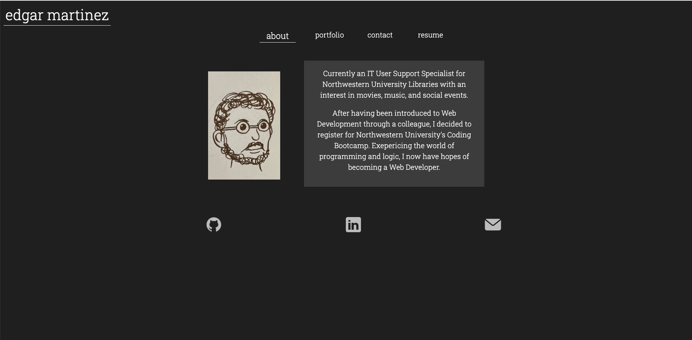
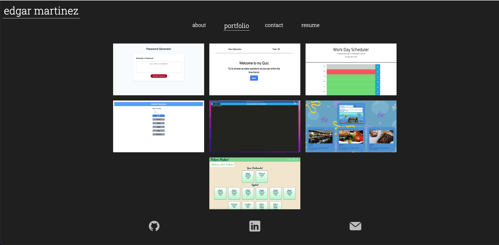
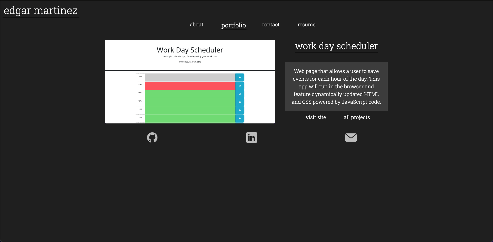
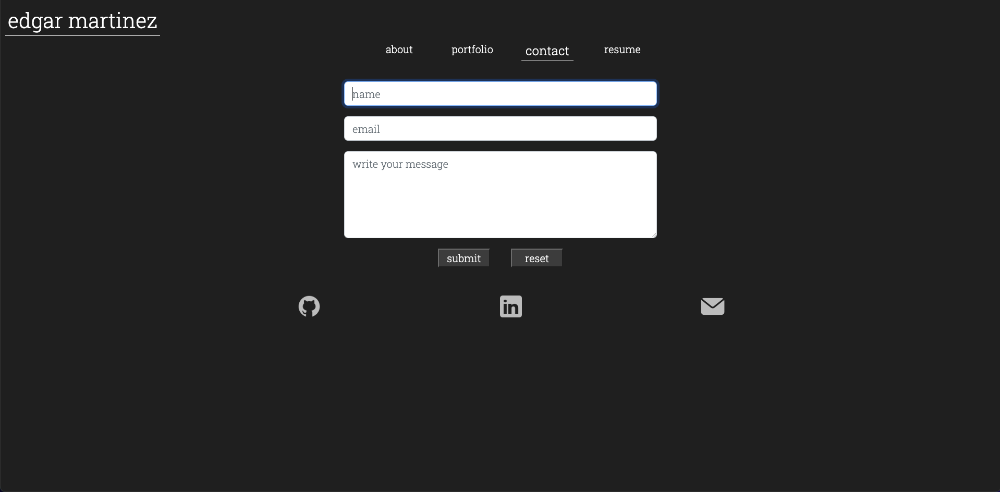
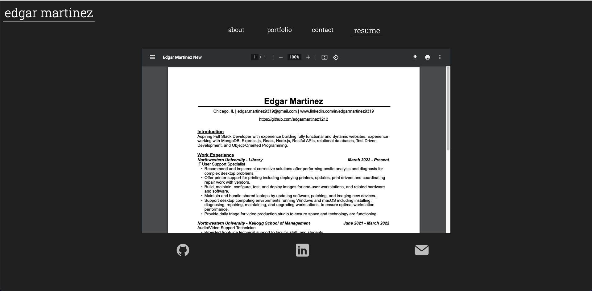

# 20 React: React Portfolio

## User Story

```md
AS a bootcamp student looking to start my career as a web developer
I WANT to showcase my profile to a potential employer
SO THAT they can assess whether I am a good candidate for an open position
```

## Acceptance Criteria

```md
GIVEN a single-page application portfolio for a web developer position

WHEN I load the portfolio
THEN I am presented with a page containing a header, a section for content, and a footer

WHEN I view the header
THEN I am presented with the developer's name and navigation with titles corresponding to different sections of the portfolio

WHEN I view the navigation titles
THEN I am presented with the titles About, Portfolio, Contact, and Resume, and the title corresponding to the current section is underlined

WHEN I click on a navigation title
THEN I am presented with the corresponding section below the navigation without the page reloading and that title is underlined

WHEN I load the portfolio the first time
THEN the About title and section are selected by default

WHEN I am presented with the About section
THEN I see an avatar of the developer and a short bio about them

WHEN I am presented with the Portfolio section
THEN I see images of seven of the developer’s applications

WHEN I click on one of the images in the Portfolio section
THEN I am presented with the selected project's card displaying the title, image, description, Visit Page link and View All Projects Link

WHEN I am presented with the Contact section
THEN I see a contact form with fields for a name, an email address, and a message

WHEN I submit the form without filling out any of the fields
THEN I receive a notification that one or more fields are required

WHEN I enter text into the email address field
THEN I receive a notification if I have entered an invalid email address

WHEN I fill out the form completely and submit
THEN I receive a notification that the message has been sent (\*does not actually send)

WHEN I am presented with the Resume section
THEN I see a PDF content section displaying the developer's resume and a button to download

WHEN I view the footer
THEN I am presented with icon links to the developer’s GitHub, LinkedIn profiles, and an email icon to send an email from the user's default email application
```

## Mock-Up

The following images show the web application's appearance

### Home Page/About Me Section



### Portfolio Section



### Selected Project



### Contact Section



### Resume Section



## Links

### GitHub Repository

https://github.com/edgarmartinez1212/React-Portfolio

### Deployed Application - GitHub Pages

https://edgarmartinez1212.github.io/React-Portfolio/
